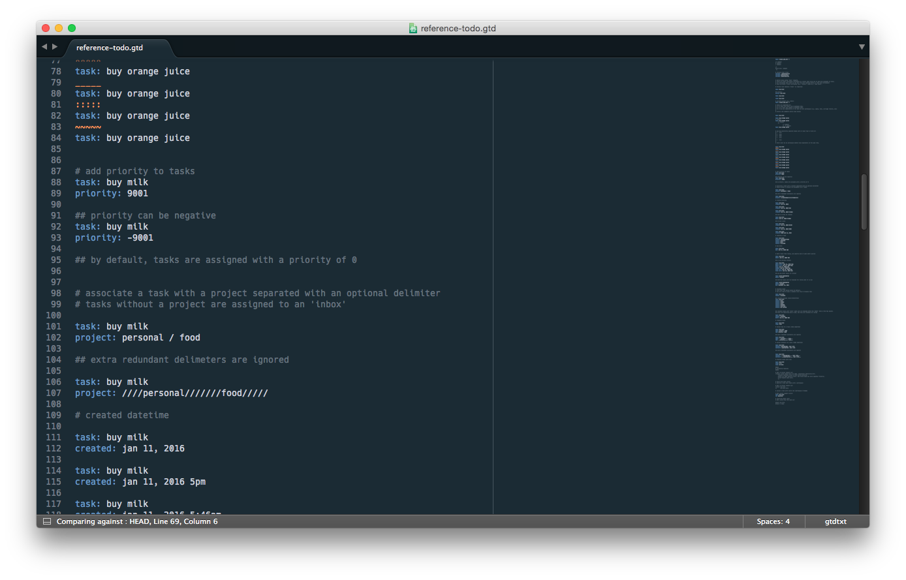

gtdtxt-sublime
==============

> Sublime syntax for gtdtxt

Installation
============

~~The easiest way to install this package is through [Package Control](http://wbond.net/sublime_packages/package_control).~~ **(not yet published)**

Otherwise, **if you have Git**: clone the repository in your Sublime Text "Packages" directory (Sublime Menu -> Preferences -> Browse Packages…).

**If you don’t have Git**, download the [source zip](https://github.com/gtdtxt/gtdtxt-sublime/archive/master.zip) and unpack it into a new directory named `gtdtxt-sublime` within your Packages directory.

Credits
=======

Adapted from https://github.com/moeffju/sublime-ledger-syntax

License
=======

MIT.
